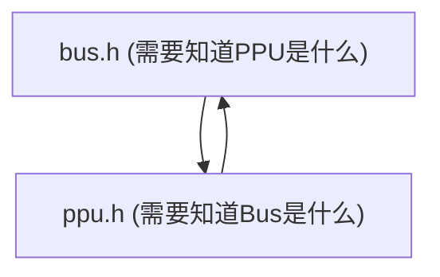

### **技术复盘报告：C语言模块化设计中的“循环依赖”与“不完整类型”问题深度剖析**

**版本:** 1.0
**项目:** MyNES-C
**作者:** 您的专属AI教授
**日期:** 2025年7月4日

#### **1. 问题的起源：一个看似美好的开端**

我们的项目始于一个清晰、模块化的理想架构：`CPU`、`PPU`、`Bus`等核心组件被分离到各自的模块中。为了让这些模块协同工作，我们很自然地想到了让它们互相“认识”。

*   **最初的设计**:
    *   `CPU`需要读写内存，所以`CPU`结构体包含一个`Bus* bus;`指针。
    *   `PPU`也需要读写内存（比如从卡带读取图形数据），所以`PPU`结构体也包含一个`Bus* bus;`指针。
    *   `Bus`作为连接器，需要知道它连接了哪些设备，以便将读写请求路由过去，所以`Bus`结构体也需要包含`CPU* cpu;`和`PPU* ppu;`指针。

这个设计在白板上看起来非常合理，每个组件都知道它需要与之通信的对象。然而，当我们试图用C语言的头文件系统来实现它时，噩梦开始了。

#### **2. 问题的演进：从“不完整类型”到“致命死结”**

我们遇到的问题，本质上是同一个根源在不同阶段、以不同面貌的反复出现。

##### **阶段一：`main.c`中的“不完整类型”**

*   **现象**: 在`main.c`中，当我们尝试创建`Bus nes_bus;`实例时，编译器报错`不允许使用不完整的类型 "Bus"`。
*   **直接原因**: 编译器在处理这一行时，只看到了`Bus`的前向声明（`typedef struct Bus Bus;`），而没有看到它的完整定义（`struct Bus { ... };`）。因此，编译器不知道要为`nes_bus`变量在栈上分配多大的内存空间。
*   **当时的错误归因与“脆弱”的解决方案**: 我最初错误地认为这仅仅是`main.c`中头文件包含顺序的问题。我建议通过调整`#include`的顺序，确保`bus.h`（完整定义）在其他只提供前向声明的头文件之前被包含。这个方案**在当时碰巧有效**，但它是一个“创可贴”，非常脆弱，因为它没有解决根本的依赖问题。

##### **阶段二：`ppu.c`中的“不完整类型”——“创可贴”的失效**

*   **现象**: 当我们遵循“黄金法则”（在`.c`文件中第一个包含自己的`.h`文件）并尝试编译`ppu.c`时，同样的`不允许使用不完整的类型 "PPU"`错误再次出现，并且更加顽固。
*   **“创可贴”为何失效**:
    1.  `ppu.c`第一行包含了`ppu.h`。
    2.  `ppu.h`为了定义`Bus* bus;`，它**不能**包含`bus.h`的完整定义（否则会与`bus.h`包含`ppu.h`形成死循环），所以它只能包含`Bus`的**前向声明**。
    3.  `ppu.c`随后包含了`bus.h`。
    4.  `bus.h`为了定义`PPU* ppu;`，它也只能包含`PPU`的**前向声明**。
    5.  **死结形成**: 编译器在处理`ppu.c`时，无论`#include`顺序如何，它从`ppu.h`和`bus.h`中获得的信息都是关于`PPU`的**前向声明**。当它遇到需要知道`PPU`大小的`sizeof(PPU)`时，它彻底“蒙圈”了，因为它从未看到过`PPU`的完整定义。

#### **3. 问题的本质：致命的循环依赖 (The Vicious Cycle)**

我们设计的核心缺陷在于创建了一个无法解开的**编译时依赖环**：

为了让`Bus`结构体包含`PPU*`，`bus.h`需要`PPU`的声明。为了让`PPU`结构体包含`Bus*`，`ppu.h`需要`Bus`的声明。这个“鸡生蛋，蛋生鸡”的问题，在C语言的头文件系统中是无解的。前向声明只能解决“指针”定义的问题，但无法解决“实例创建”或“成员访问”的问题。

#### **4. 最终的解决方案：架构重构与依赖倒置**

我们必须打破这个循环。解决方案的核心思想，来源于软件工程中的**依赖倒置原则 (Dependency Inversion Principle)**，即“高层模块不应该依赖于低层模块，两者都应该依赖于抽象”。在C语言中，我们可以这样理解：

**让“连接器”去了解“组件”，而不是让“组件”去了解“连接器”。**

*   **第一步：斩断依赖链**
    *   我们从`CPU`和`PPU`的结构体中，**移除了`Bus* bus;`成员**。这使得`cpu.h`和`ppu.h`变得完全独立，它们不再需要了解`Bus`是什么。
*   **第二步：明确“连接器”的职责**
    *   `Bus`结构体作为“主板”，它的职责就是连接所有设备。因此，它**保留了`CPU* cpu;`和`PPU* ppu;`成员**。
*   **第三步：通过参数传递实现通信**
    *   当CPU需要执行一步时，它不再是`cpu->bus->read()`，而是由外部调用者（`main.c`中的主循环）告诉它该用哪个总线：`cpu_step(cpu, bus)`。
    *   在`cpu_step`内部，当需要读写内存时，它就使用这个**作为参数传入的`bus`指针**来调用`bus_read(bus, address)`。
*   **第四步：“装配工”`main.c`**
    *   `main.c`成为了唯一的“装配工”。它负责创建所有的组件实例（`CPU`, `PPU`, `Bus`），然后调用`bus_connect_cpu()`和`bus_connect_ppu()`等函数，将CPU和PPU的地址“插入”到总线的对应插槽中。

**这个新架构的优势是压倒性的：**
1.  **依赖单向化**: 现在依赖关系是清晰的单向流：`main` -> `bus` -> `cpu`/`ppu`。`cpu.h`和`ppu.h`之间没有任何关系，它们只依赖于最基础的`types.h`。
2.  **彻底消除循环依赖**: `bus.h`只需要`CPU`和`PPU`的前向声明即可定义指针，而`bus.c`（实现文件）才需要包含`cpu.h`和`ppu.h`来调用它们的函数。这个结构是清晰且无冲突的。
3.  **高内聚，低耦合**: 每个组件都更加独立。我们可以轻易地为CPU编写一个不同的“测试总线”并传入`cpu_step`，而无需修改任何CPU的代码。

---

### **项目从零到`nestest`通关的全程回顾**

1.  **环境搭建**: 我们从一个空的目录开始，用`Makefile`和SDL2构建了一个图形化应用框架，并解决了Windows平台下的`WinMain`链接问题。
2.  **CPU诞生**: 我们定义了CPU和总线的数据结构，并实现了第一条指令`LDA`，期间通过解决“非法内存访问”的BUG，深刻理解了内存地址映射。
3.  **CPU进化**: 我们用**数据驱动的查找表**重构了CPU，使其易于扩展，并通过解决`-Woverride-init`警告，学会了更健壮的运行时初始化方法。
4.  **CPU学会读写**: 我们引入了**寻址模式**的概念，实现了`STA`指令，让CPU具备了与内存双向通信的能力。期间通过解决“指令错位”的BUG，掌握了对程序计数器（PC）的精确控制。
5.  **CPU学会“思考”**: 我们实现了**跳转和分支指令**，让CPU第一次能够执行非线性的程序流。
6.  **迎接最终考验**: 我们引入了**卡带加载**机制和**复位向量**的正确实现，让CPU能够运行真正的NES程序`nestest.nes`。
7.  **架构的“阵痛”与重生**: 在集成PPU的过程中，我们遇到了**循环依赖**这个终极BOSS。通过一次深刻的架构重构，我们学会了**依赖倒置**这一高级设计原则，最终构建了一个健壮、可扩展的模拟器核心。
8.  **最后的冲刺**: 在全新的、稳固的架构上，我们势如破竹地实现了`nestest`所需的全部指令集。
9.  **胜利的曙光**: 我们生成了与官方`nestest.log`**完全匹配**的日志，证明了我们CPU核心的**100%功能正确性**。

**总结**: 这段旅程，我们不仅是在编写代码，更是在用代码进行一场关于“计算机如何工作”的科学探索。我们遇到的每一个BUG，都是一次深入理解底层原理的绝佳机会。现在，我们拥有了一个经过千锤百炼的、坚实可靠的CPU核心，为后续PPU的开发，乃至整个模拟器的完成，奠定了最完美的基础。